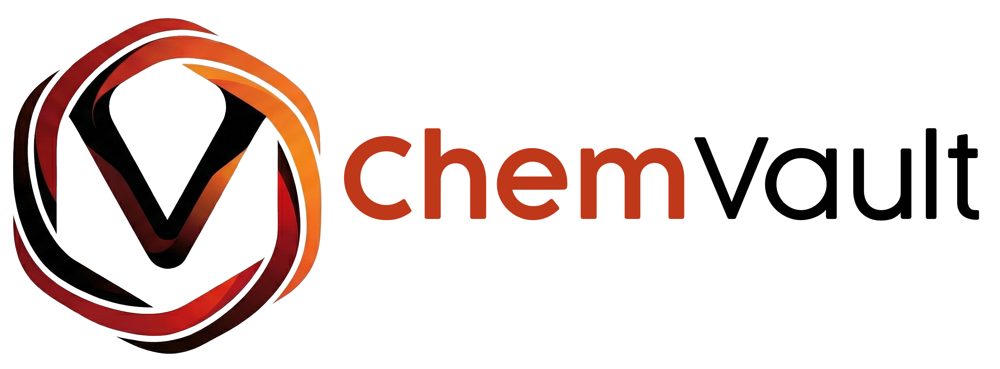
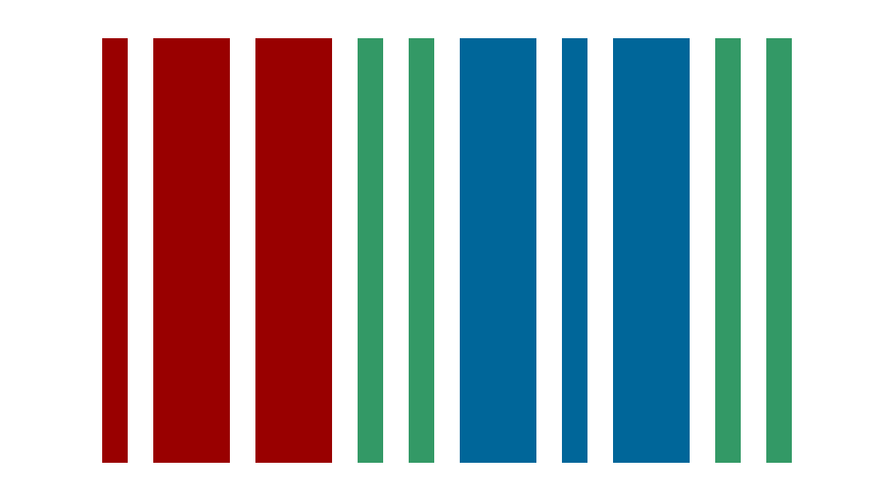

<div align="center">



### Chemical Structure Validation & Quality Assessment Platform

[](https://opensource.org/licenses/MIT)
[](https://doi.org/10.5281/zenodo.18492676)
[](https://github.com/Kohulan/ChemAudit/releases)
[](https://github.com/Kohulan/ChemAudit/actions/workflows/test.yml)
[](https://kohulan.github.io/ChemAudit/)
[](https://github.com/Kohulan/ChemAudit/graphs/contributors)
[](https://github.com/Kohulan/ChemAudit/issues)
[](https://www.python.org/downloads/)
[](https://reactjs.org/)
[](https://fastapi.tiangolo.com/)
[](https://www.rdkit.org/)
[](https://www.docker.com/)

<br />

**Validate &bull; Standardize &bull; Score &bull; Profile &bull; Curate &bull; Analyze**

*A comprehensive web platform for cheminformatics workflows, drug discovery, ML dataset curation, and generative chemistry evaluation*

[Features](#-features) &bull;
[Quick Start](#-quick-start) &bull;
[Documentation](https://www.kohulanr.com/ChemAudit/) &bull;
[API](#-api-reference) &bull;
[MCP](#-mcp-server-model-context-protocol) &bull;
[CLI](#-command-line-interface) &bull;
[Contributing](#-contributing)

<br />


</div>

---

## ✨ Features

<table>
<tr>
<td width="50%">

### Structure Validation
Comprehensive chemical structure analysis with 15+ validation checks

- Valence, connectivity & aromaticity errors
- Stereochemistry & ring system analysis
- Atom & bond type verification
- Configurable validation profiles with 8 presets

</td>
<td width="50%">

### Structural Alerts
Screen compounds against known problematic substructures

- **PAINS** - Pan-Assay Interference detection
- **BRENK** - Unwanted group filters
- **Kazius & NIBR** - Additional alert catalogs
- Concern-group deduplication across catalogs

</td>
</tr>
<tr>
<td width="50%">

### ML-Readiness Scoring
Evaluate compound suitability for machine learning

- 4-dimension scientific assessment
- Descriptor calculability & fingerprint validation
- Molecular complexity scoring
- Profile-based scoring with custom presets

</td>
<td width="50%">

### Standardization Pipeline
ChEMBL-compatible molecular standardization

- Salt stripping & neutralization
- Tautomer canonicalization
- Stereochemistry normalization
- Cross-pipeline comparison (RDKit vs ChEMBL)

</td>
</tr>
</table>

### Data Preparation Suite

<table>
<tr>
<td width="50%">

#### QSAR-Ready Pipeline
A 10-step curation pipeline producing ML-ready structures

- Desalting, neutralisation, tautomer canonicalisation
- InChIKey deduplication with change tracking per stage
- Configurable steps with 3 presets (QSAR-2D, QSAR-3D, Minimal)
- Batch processing via Celery with WebSocket progress

</td>
<td width="50%">

#### Structure Filter
Validation funnel for generative model output (REINVENT, etc.)

- 6-stage funnel: parse, valence, alerts, property, SA, dedup
- Optional novelty check via ChEMBL Tanimoto similarity
- REINVENT-compatible scoring endpoint
- Interactive funnel visualisation showing drop-out points

</td>
</tr>
<tr>
<td width="50%">

#### Dataset Audit
Upload a dataset and get a comprehensive health score

- Structural issues, standardisation inconsistencies, property distributions
- Contradictory label detection (same InChIKey, opposite activity)
- Full curation report generation
- Dataset diff to compare before/after curation

</td>
<td width="50%">

#### Diagnostics
Debugging toolkit for chemical data issues

- SMILES error annotation with exact break position
- InChI layer-by-layer diff tables
- SMILES-InChI-SMILES round-trip loss detection
- Cross-pipeline comparison (RDKit vs ChEMBL vs Minimal)
- File pre-validator: encoding, duplicate headers, malformed rows

</td>
</tr>
</table>

### Compound Profiler

<table>
<tr>
<td width="50%">

- **PFI** - Property Forecast Index (Young et al. 2011)
- **Ligand Efficiency** - LE, LLE, LELP, BEI, SEI metrics
- **SA Comparison** - Three independent scorers (SA Score, SCScore, SYBA)
- **3D Shape Analysis** - PMI ternary plots via ETKDGv3/MMFF94

</td>
<td width="50%">

- **Skin Permeation** - Potts-Guy 1992 model
- **CNS MPO** - Wager 2010 multi-parameter optimisation
- **Custom MPO Editor** - Define your own desirability functions with sigmoid/ramp/step shapes per property

</td>
</tr>
</table>

### Safety Assessment

- **CYP Soft Spot Prediction** - 11 SMARTS-based metabolic liability patterns with atom-level highlighting
- **hERG Liability Scoring** - 4-factor amphiphile risk model
- **Beyond Rule of 5 (bRo5)** - Doak et al. 2014 thresholds for extended chemical space
- **REOS Filtering** - Walters 1999 rapid elimination of swill
- **Concern-Group Deduplication** - Same alert not flagged by multiple catalogs

### Database Integrations & Identifier Resolution

- **Universal Identifier Resolution** - Paste SMILES, InChI, InChIKey, CAS, common name, ChEMBL ID, PubChem CID, or more
- **Cross-Reference** across PubChem, ChEMBL, COCONUT, Wikidata, ChEBI, and UniChem
- **Side-by-side comparison** with stereochemistry-aware diffing
- **SureChEMBL** patent presence lookups via UniChem cross-reference

### Batch Analytics

- **Butina Clustering** with configurable distance cutoff
- **Murcko Scaffold Analysis** with interactive treemap visualisation
- **Chemotype Taxonomy** - SMARTS-based classification with 50+ rules
- **Registration Hash Collision Detection** - RDKit RegistrationHash v2 with tautomer support
- **MCS Comparison** - Select any two molecules for side-by-side analysis with Tanimoto similarity, common substructure, and property delta table
- **Click-to-filter drill-down** across all analytics charts
- **Shareable Permalink Reports** with auto-snapshot persistence

### Export System

Full 78-column audit trail across 6 sections (Validation, Deep Validation, Scoring, Safety, Compound Profile, Standardization). One declarative registry drives all five exporters:

| Format | Features |
|--------|----------|
| **CSV** | All 78 audit columns, always included |
| **Excel** | Single-sheet or multi-sheet layout, optional 2D structure depictions, conditional score formatting |
| **JSON** | Nested audit structure |
| **SDF** | Optional full audit data toggle |
| **PDF** | Batch report with optional full audit data toggle |

---

## 🚀 Quick Start

### Using Docker (Recommended)

```bash
# Clone the repository
git clone https://github.com/Kohulan/ChemAudit.git
cd chemaudit

# Start all services (development)
docker-compose up -d

# View logs
docker-compose logs -f
```

**Access Points:**
| Service | URL |
|---------|-----|
| Web UI | http://localhost:3002 |
| API Docs | http://localhost:8001/docs |
| MCP Server | http://localhost:8001/mcp |
| Metrics | http://localhost:9090 |

### Production Deployment

Use the interactive deploy script to select a deployment profile:

```bash
# Interactive mode - shows profile menu
./deploy.sh

# Or specify profile directly
./deploy.sh medium
```

**Available Profiles:**

| Profile | Max Molecules | Max File Size | Workers | Use Case |
|---------|---------------|---------------|---------|----------|
| `small` | 1,000 | 100 MB | 2 | Development |
| `medium` | 10,000 | 500 MB | 4 | Standard production |
| `large` | 50,000 | 500 MB | 8 | High-throughput |
| `xl` | 100,000 | 1 GB | 12 | Enterprise |
| `coconut` | 1,000,000 | 1 GB | 16 | Full COCONUT DB |

See [Deployment Guide](docs/DEPLOYMENT.md) for detailed configuration.

### Manual Installation

<details>
<summary><b>Backend Setup</b></summary>

```bash
cd backend
pip install -e ".[dev]"
uvicorn app.main:app --reload --port 8000
```

</details>

<details>
<summary><b>Frontend Setup</b></summary>

```bash
cd frontend
npm install
npm run dev
```

</details>

---

## 💻 Command-Line Interface

ChemAudit includes a CLI tool with 4 subcommands:

```bash
# Validate a molecule
chemaudit validate --smiles "CCO" --format table

# Score a molecule
chemaudit score --smiles "CC(=O)Oc1ccccc1C(=O)O"

# Standardize a molecule
chemaudit standardize --smiles "CC(=O)[O-].[Na+]"

# Profile a molecule
chemaudit profile --smiles "c1ccccc1"

# Process a file
chemaudit validate --file molecules.csv --format json

# Pipe from stdin
echo "CCO" | chemaudit validate --format table
```

All commands support `--local` (offline mode), `--server` (remote API), and `--format json|table` output.

---

## 📦 Batch Processing

Process large datasets with real-time progress tracking:

| Feature | Specification |
|---------|---------------|
| **Max File Size** | Up to 1 GB (profile-dependent) |
| **Max Molecules** | Up to 1,000,000 per batch (profile-dependent) |
| **Supported Formats** | SDF, CSV |
| **Progress Tracking** | Real-time WebSocket updates |
| **Export Formats** | CSV, JSON, Excel, SDF, PDF Report |

```python
# Python client example
from chemaudit import ChemAuditClient

client = ChemAuditClient("http://localhost:8000")

# Upload and process
job = client.upload_batch("molecules.sdf")

# Monitor progress
for update in client.stream_progress(job.job_id):
    print(f"Progress: {update.progress}%")

# Get results
results = client.get_results(job.job_id)
```

---

## 📸 Screenshots

<div align="center">
<table>
<tr>
<td align="center"><b>Single Molecule Validation</b></td>
<td align="center"><b>Batch Processing</b></td>
</tr>
<tr>
<td></td>
<td></td>
</tr>
<tr>
<td align="center"><b>Scoring Dashboard</b></td>
<td align="center"><b>Database Lookup</b></td>
</tr>
<tr>
<td></td>
<td></td>
</tr>
</table>
</div>

---

## 🛠 Tech Stack

<div align="center">

| Layer | Technologies |
|-------|-------------|
| **Frontend** |     |
| **Backend** |     |
| **Database** |   |
| **Infrastructure** |   |
| **Monitoring** |   |
| **AI Integration** | MCP Server (Model Context Protocol) for AI-assisted workflows |

</div>

---

## 📚 Documentation

| Document | Description |
|----------|-------------|
| [Getting Started](docs/GETTING_STARTED.md) | Installation and first steps |
| [User Guide](docs/USER_GUIDE.md) | Complete usage instructions |
| [API Reference](docs/API_REFERENCE.md) | Full REST API documentation |
| [Deployment](docs/DEPLOYMENT.md) | Production deployment guide |
| [Troubleshooting](docs/TROUBLESHOOTING.md) | Common issues & solutions |

**Interactive API Docs:** http://localhost:8000/docs

---

## 📡 API Reference

### Validate a Molecule

```bash
curl -X POST http://localhost:8000/api/v1/validate \
  -H "Content-Type: application/json" \
  -d '{"molecule": "CC(=O)Oc1ccccc1C(=O)O", "format": "smiles"}'
```

### Resolve an Identifier

```bash
curl -X POST http://localhost:8000/api/v1/integrations/resolve \
  -H "Content-Type: application/json" \
  -d '{"identifier": "aspirin"}'
```

### Run Safety Assessment

```bash
curl -X POST http://localhost:8000/api/v1/safety/assess \
  -H "Content-Type: application/json" \
  -d '{"smiles": "c1ccc2c(c1)nc(n2)Sc3nnnn3C"}'
```

### Profile a Compound

```bash
curl -X POST http://localhost:8000/api/v1/profiler/full \
  -H "Content-Type: application/json" \
  -d '{"smiles": "CC(=O)Oc1ccccc1C(=O)O"}'
```

---

## 🤖 MCP Server (Model Context Protocol)

ChemAudit exposes an MCP server that lets AI assistants (Claude, Cursor, Windsurf, etc.) call its chemistry tools directly. Built with [`fastapi-mcp`](https://github.com/tadata-ru/fastapi-mcp), it auto-generates **~68 tools** from the existing API — no separate server to run.

### Quick Setup

Add to your MCP client config (e.g. `claude_desktop_config.json`, `.cursor/mcp.json`, or `~/.claude/settings.json`):

```json
{
  "mcpServers": {
    "chemaudit": {
      "type": "sse",
      "url": "http://localhost:8001/mcp"
    }
  }
}
```

For production deployments behind nginx, use:

```json
{
  "mcpServers": {
    "chemaudit": {
      "type": "sse",
      "url": "https://your-domain.com/mcp"
    }
  }
}
```

### Available Tool Categories

| Category | Tools | Examples |
|----------|-------|---------|
| **Validation** | 4 | Validate molecule, list checks, compute similarity |
| **Scoring** | 2 | ML-readiness score, radar comparison |
| **Standardization** | 2 | ChEMBL-compatible standardization |
| **Alerts & Safety** | 6 | PAINS/BRENK screening, CYP/hERG/bRo5/REOS |
| **Compound Profiler** | 5 | PFI, 3D shape, SA comparison, ligand efficiency, MPO |
| **Identifier Resolution** | 1 | Resolve SMILES, InChI, CAS, ChEMBL ID, name, etc. |
| **Database Integrations** | 6 | PubChem, ChEMBL, COCONUT, Wikidata, SureChEMBL |
| **Diagnostics** | 5 | SMILES errors, InChI diff, round-trip, cross-pipeline |
| **QSAR-Ready** | 5 | Single/batch curation pipeline |
| **Structure Filter** | 7 | Generative model funnel, REINVENT scoring |
| **Dataset Intelligence** | 6 | Health audit, contradictions, dataset diff |
| **Batch & Export** | 11 | Upload, process, analytics, export (CSV/Excel/SDF/JSON/PDF) |
| **Scoring Profiles** | 7 | Create, manage, import/export custom profiles |

### Security

Admin endpoints (API key management, config, sessions) are **never** exposed via MCP. A runtime assertion on startup verifies no admin tags leak into the MCP allowlist.

### Example AI Interaction

Once connected, you can ask your AI assistant:

> "Validate the molecule CC(=O)Oc1ccccc1C(=O)O and check for PAINS alerts"

> "Resolve aspirin across PubChem, ChEMBL, and COCONUT and compare the structures"

> "Run the QSAR-ready pipeline on this SMILES: CN1C=NC2=C1C(=O)N(C(=O)N2C)C"

---

## 🧠 Agent Skills

ChemAudit ships as a **Claude Code plugin** with 8 domain skills that coordinate the API, MCP server, and CLI into workflow-aware guidance. Skills activate automatically when a user's request matches their trigger phrases — no manual invocation required.

### Skills

| Skill | Use when the user asks about… |
|---|---|
| **chemaudit-molecule-validation** | single-molecule validation, drug-likeness, deep checks, PAINS, ML-readiness |
| **chemaudit-batch-validation** | CSV/SDF bulk processing, clustering, scaffold analysis, 9 export formats |
| **chemaudit-qsar-ready** | ML-dataset curation, 10-step pipeline, InChIKey deduplication, QSAR-2D vs 3D |
| **chemaudit-structure-filter** | generative-model output filtering, REINVENT 4 scoring, drug-like / lead-like / fragment-like funnel |
| **chemaudit-dataset-intelligence** | dataset health scoring, contradictory bioactivity labels, dataset-version diffs |
| **chemaudit-standardization** | ChEMBL-compatible standardization with per-stage provenance |
| **chemaudit-diagnostics** | SMILES parse errors, InChI layer diff, round-trip lossiness, file pre-validation |
| **chemaudit-database-integrations** | PubChem / ChEMBL / COCONUT / Wikidata / SureChEMBL lookups, identifier resolution (CAS, ChEMBL ID, names) |

### Installation

The repo includes a `.claude-plugin/plugin.json` and a root `.mcp.json` for zero-config MCP auto-discovery:

```bash
# Clone the repo
git clone https://github.com/Kohulan/ChemAudit.git && cd ChemAudit

# Start the stack — MCP server becomes available at :8001/mcp
docker compose up -d

# Open the directory in Claude Code — skills and MCP server auto-connect
claude .
```

Skills live in [`skills/chemaudit-*/SKILL.md`](skills/) and are distributed via the plugin manifest. Each skill is under 5,000 words and uses Anthropic's [progressive disclosure](https://docs.claude.com/en/docs/claude-code/plugins) pattern — YAML frontmatter loaded into context, SKILL.md loaded on trigger, `references/` files loaded only when needed.

### Example AI workflow

With skills installed, users can say:

> "Upload this CSV through QSAR-ready with tautomer canonicalization on, show me how many molecules changed InChIKey, and export the curated CSV"

Claude recognizes the `chemaudit-qsar-ready` skill, calls `/qsar-ready/batch/upload` with the right config, polls via WebSocket, counts `inchikey_changed=true` entries, and downloads the curated CSV — all without the user specifying any endpoint names.

---

## 🏗 Project Structure

```
chemaudit/
├── backend/
│   ├── app/
│   │   ├── api/routes/          # 22 API route modules
│   │   ├── core/                # Config, security, rate limiting, sessions
│   │   ├── schemas/             # Pydantic v2 models
│   │   ├── services/            # Business logic
│   │   │   ├── validation/      # 15+ validation checks
│   │   │   ├── scoring/         # ML-readiness, NP-likeness
│   │   │   ├── alerts/          # PAINS, BRENK, Kazius, NIBR
│   │   │   ├── profiler/        # PFI, SA, MPO, ligand efficiency, 3D shape
│   │   │   ├── safety/          # CYP, hERG, bRo5, REOS, unified screen
│   │   │   ├── diagnostics/     # SMILES, InChI, round-trip, cross-pipeline
│   │   │   ├── qsar_ready/      # 10-step curation pipeline
│   │   │   ├── structure_filter/ # Generative model validation funnel
│   │   │   ├── dataset_intelligence/ # Health audit, contradictory labels, diff
│   │   │   ├── analytics/       # Clustering, scaffold, taxonomy, MCS, RegHash
│   │   │   ├── integrations/    # PubChem, ChEMBL, COCONUT, Wikidata, SureChEMBL
│   │   │   └── export/          # CSV, Excel, SDF, JSON, PDF (78-column audit)
│   │   ├── cli.py               # CLI tool (4 subcommands)
│   │   └── templates/           # PDF report templates
│   └── tests/
├── frontend/
│   ├── src/
│   │   ├── components/          # React components
│   │   ├── pages/               # 15 route pages
│   │   ├── services/            # API client
│   │   ├── hooks/               # Custom hooks
│   │   └── types/               # TypeScript definitions
│   └── tests/
├── client/                      # Python client library
├── docs-site/                   # Docusaurus documentation site
├── nginx/                       # Reverse proxy config
├── .github/workflows/           # CI/CD (tests, lint, release, secret scanning)
├── SECURITY.md                  # Security policy
└── docker-compose.yml
```

---

## 🔒 Security

ChemAudit implements defense-in-depth security:

- **API Key Authentication** with Redis-backed key management
- **Rate Limiting** per-IP and per-API-key tiers with progressive IP banning
- **Session Isolation** via HttpOnly cookies and PostgreSQL row-level security
- **WebSocket Ownership Checks** preventing cross-session data access
- **CSRF Protection** and Content Security Policy headers
- **Secret Scanning** via Gitleaks in CI

See [SECURITY.md](SECURITY.md) for vulnerability reporting.

---

## 🧪 Running Tests

```bash
# Backend tests
cd backend
pytest tests/ -v

# Frontend tests
cd frontend
npm test

# With coverage
pytest tests/ --cov=app --cov-report=xml
```

---

## 🤝 Contributing

Contributions are welcome! Please read our contributing guidelines before submitting a PR.

1. Fork the repository
2. Create a feature branch (`git checkout -b feature/amazing-feature`)
3. Commit your changes (`git commit -m 'Add amazing feature'`)
4. Push to the branch (`git push origin feature/amazing-feature`)
5. Open a Pull Request

---

## 📄 License

This project is licensed under the MIT License - see the [LICENSE](LICENSE) file for details.

---

## 🙏 Acknowledgments

<div align="center">

*Built on the shoulders of these outstanding open-source projects and databases*

<br />

<table>
<tr>
<td align="center" width="140">
<br />
<a href="https://www.rdkit.org/">

</a>
<br /><br />
<sub>Cheminformatics<br />Toolkit</sub>
<br /><br />
</td>
<td align="center" width="140">
<br />
<a href="https://www.ebi.ac.uk/chembl/">

</a>
<br />
<sub><b>ChEMBL</b></sub>
<br />
<sub>Bioactivity<br />Database</sub>
<br /><br />
</td>
<td align="center" width="140">
<br />
<a href="https://pubchem.ncbi.nlm.nih.gov/">

</a>
<br />
<sub><b>PubChem</b></sub>
<br />
<sub>Chemical<br />Database</sub>
<br /><br />
</td>
<td align="center" width="140">
<br />
<a href="https://coconut.naturalproducts.net/">

</a>
<br />
<sub><b>COCONUT</b></sub>
<br />
<sub>Natural Products<br />Database</sub>
<br /><br />
</td>
</tr>
<tr>
<td align="center" width="140">
<br />
<a href="https://www.ebi.ac.uk/chebi/">

</a>
<br /><br />
<sub>Chemical Entities of<br />Biological Interest</sub>
<br /><br />
</td>
<td align="center" width="140">
<br />
<a href="https://www.ebi.ac.uk/unichem/">

</a>
<br /><br />
<sub>Cross-Reference<br />Mapping Service</sub>
<br /><br />
</td>
<td align="center" width="140">
<br />
<a href="https://www.wikidata.org/">

</a>
<br />
<sub><b>Wikidata</b></sub>
<br />
<sub>Open<br />Knowledge Base</sub>
<br /><br />
</td>
<td align="center" width="140">
<br />
<a href="https://www.surechembl.org/">

</a>
<br />
<sub><b>SureChEMBL</b></sub>
<br />
<sub>Patent Chemistry<br />Database</sub>
<br /><br />
</td>
</tr>
</table>

</div>

---

<div align="center">

<a href="https://www.uni-jena.de/">

</a>

<br /><br />

Made with ☕ by [Kohulan Rajan](https://github.com/Kohulan) at [Friedrich Schiller University Jena](https://www.uni-jena.de/)

<br />

**[Back to Top](#)**

</div>
